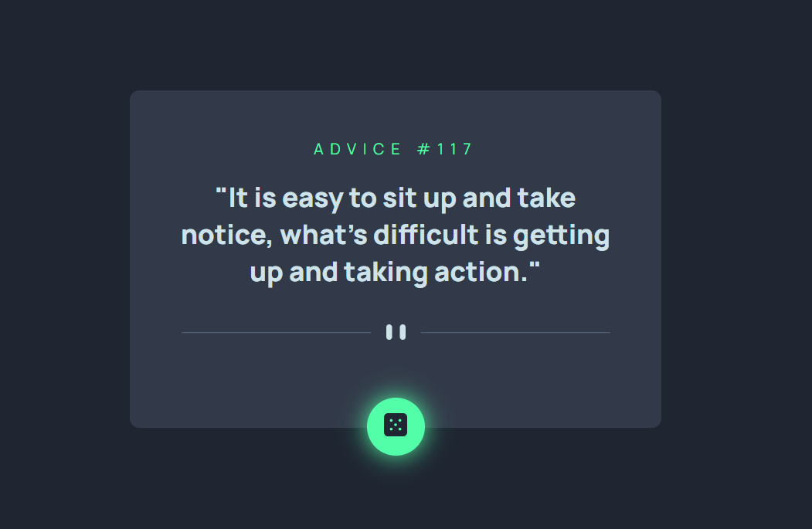

# Advice Generator APP Main (Frontend Mentor)
Um projeto do frontend mentor. Este é meu segundo projeto feito no frontend mentor, sugerido pelo curso como exercício de HTML e CSS avançado.

## Sobre
Foi o segundo projeto do curso, e eu sinto que me sai muito melhor que no primeiro, usei pouco as referências do estudo em relação ao primeiro projeto, e pesquisei poucas coisas na internet.

## Tecnologias utilizadas
- HTML
- CSS
